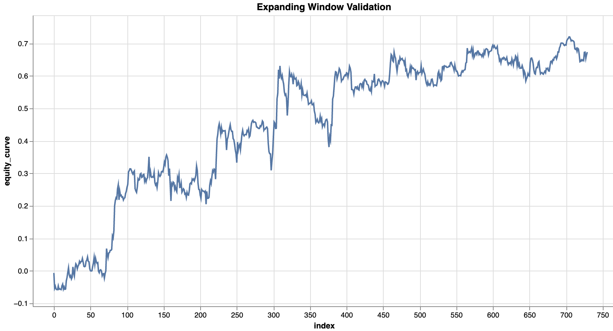

# Prereq

Copy over your "cache" folder

# Current results

## 12h, sliding window

- Time interval: 12h
- Model: LinearModel
- Training mode: Sliding window

## 12h, expanding window

- Time interval: 12h
- Model: LinearModel
- Training mode: Expanding window

## 12h, sliding window, NonLinear

- Time interval: 12h
- Model: NonLinearModel
- Training mode: Sliding window

## 12h, expanding window, NonLinear

- Time interval: 12h
- Model: NonLinearModel
- Training mode: Expanding window

## 1h, sliding window

- Time interval: 1h
- Model: LinearModel
- Training mode: Sliding window

## 1h, expanding window

- Time interval: 1h
- Model: LinearModel
- Training mode: Expanding window

