# Test results (static window training vs sliding window vs expanding window)

Given:
Trainig window - 01-10-2022 to 01-10-2023
Validation window - 01-10-2023 to 01-10-2024

| N   | lags | model | interval, h | optimizer | equity_1y_static | net_taker_1y_static | equity_2y_static | net_taker_2y_static | net_taker_2y_static_chart | equity_2y_sliding | net_taker_2y_sliding | net_taker_2y_sliding_chart | equity_2y_expanding | net_taker_2y_expanding | net_taker_2y_expanding_chart |
| --- | ---- | ----- | ----------- | --------- | ---------------- | ------------------- | ---------------- | ------------------- | ------------------------- | ----------------- | -------------------- | -------------------------- | ------------------- | ---------------------- | ---------------------------- |
| 1   | 4    | L     | 8           | Adam      | 0.721371         | 0.063672            |                  |                     |                           |                   |                      |                            | 0.202199            | -1.111998              | 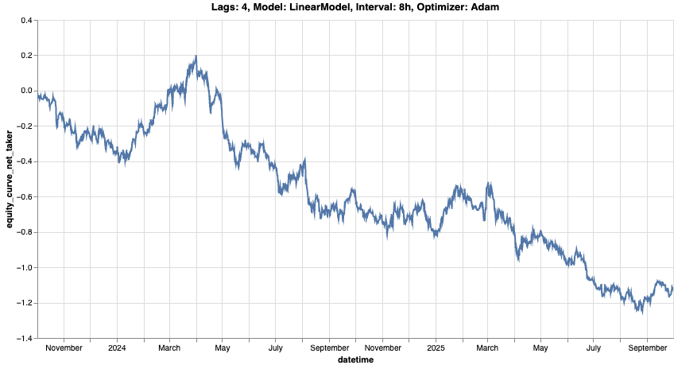    |
| 2   | 4    | L     | 8           | NotAdam   | 0.753876         | 0.096177            |                  |                     |                           |                   |                      |                            |                     |                        |                              |
| 3   | 4    | L     | 12          | Adam      | 1.259911         | 0.822445            | 0.990186         | 0.114655            | 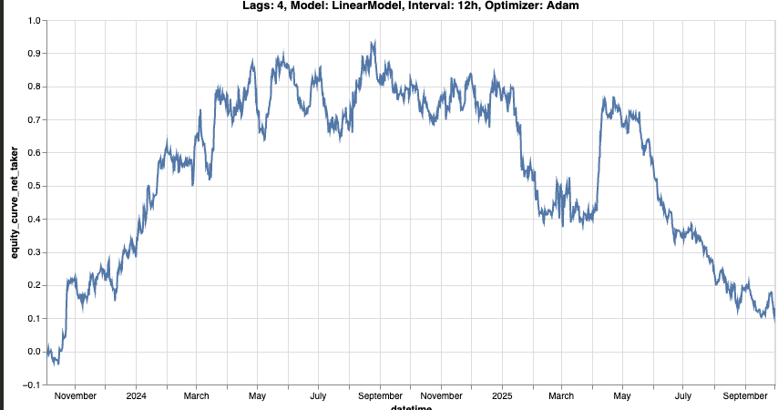    | 1.335340          | 0.459209             | 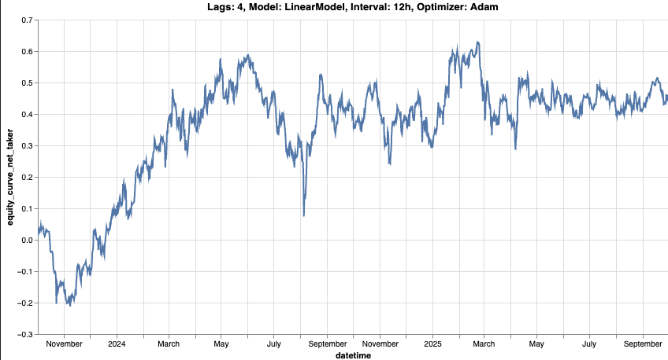  | 1.807219            | 0.931088               | 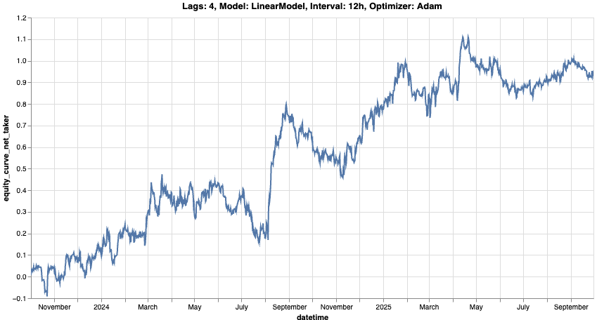    |
| 4   | 4    | L     | 12          | NotAdam   | 1.259911         | 0.822445            | 0.990186         | 0.114655            | 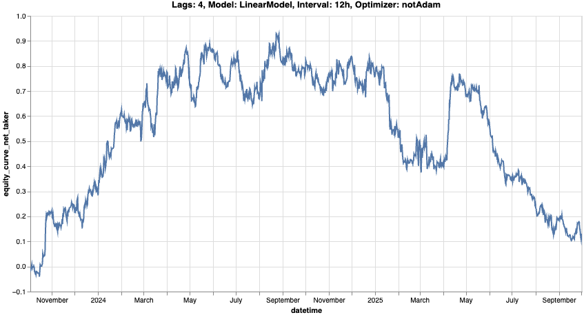  | 1.359103          | 0.482971             | 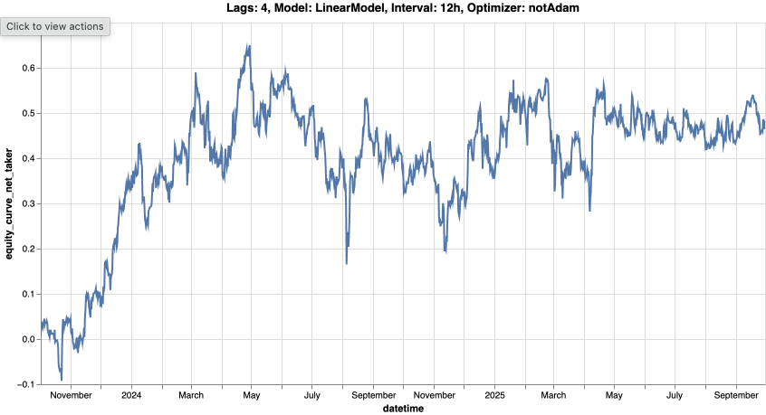  |                     |                        |                              |
| 5   | 4    | NonL  | 8           | Adam      | 0.163839         | -0.493860           |                  |                     |                           |                   |                      |                            |                     |                        |                              |
| 6   | 4    | NonL  | 8           | NotAdam   | 0.116419         | -0.541280           |                  |                     |                           |                   |                      |                            |                     |                        |                              |
| 7   | 4    | NonL  | 12          | Adam      | 0.227997         | -0.209469           |                  |                     |                           |                   |                      |                            |                     |                        |                              |
| 8   | 4    | NonL  | 12          | NotAdam   | 0.165540         | -0.271925           |                  |                     |                           |                   |                      |                            |                     |                        |                              |
| 9   | 8    | L     | 8           | Adam      | 0.864414         | 0.209115            |                  |                     |                           |                   |                      |                            | 0.937896            | -0.376301              | 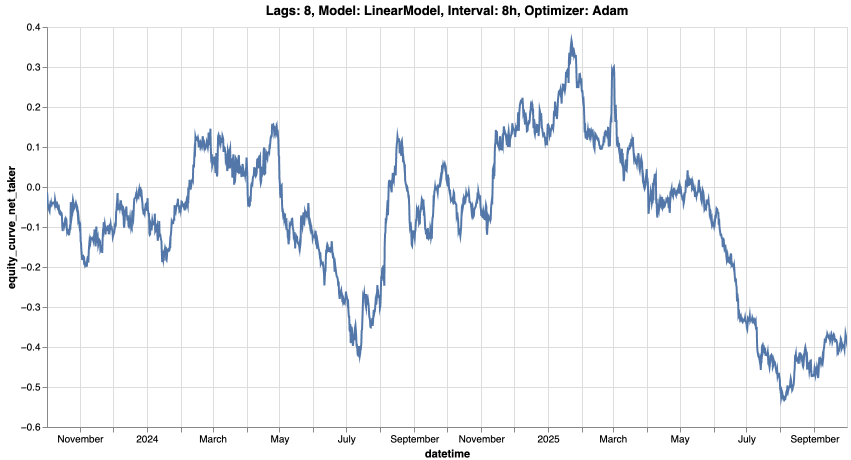    |
| 10  | 8    | L     | 8           | NotAdam   | 0.864414         | 0.209115            |                  |                     |                           |                   |                      |                            |                     |                        |                              |
| 11  | 8    | L     | 12          | Adam      | 1.061447         | 0.626382            | 1.281655         | 0.408524            | 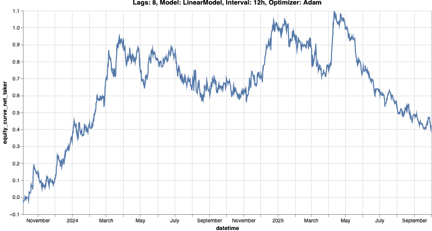  | 2.534873          | 1.624547             | 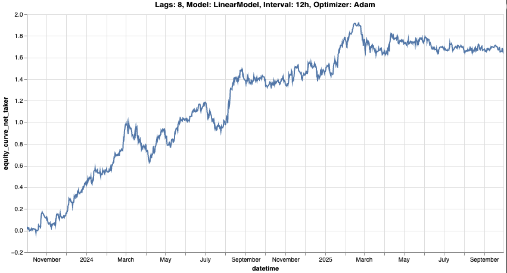  | 1.700422            | 0.824291               | 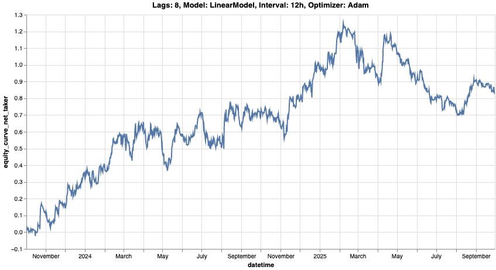    |
| 12  | 8    | L     | 12          | NotAdam   | 1.108609         | 0.673544            | 1.281655         | 0.408524            |   | 2.500678          | 1.624547             |   | 1.810326            | 0.934195               | 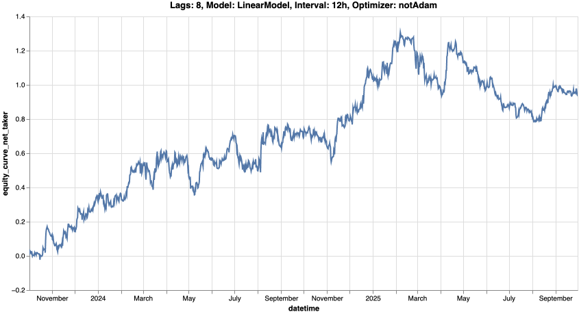    |
| 13  | 8    | NonL  | 8           | Adam      | 1.294732         | 0.639434            | -0.100156        | -1.412553           | 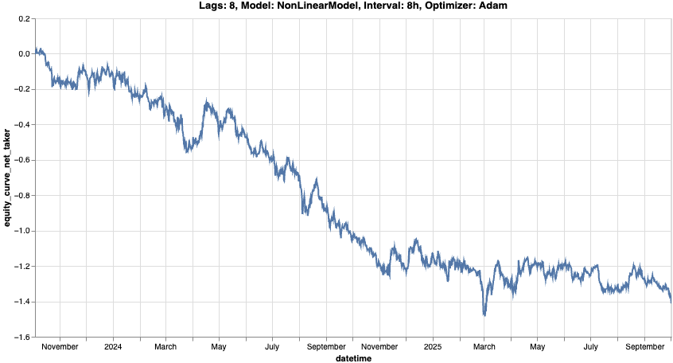  | 0.959019          | -0.355178            | 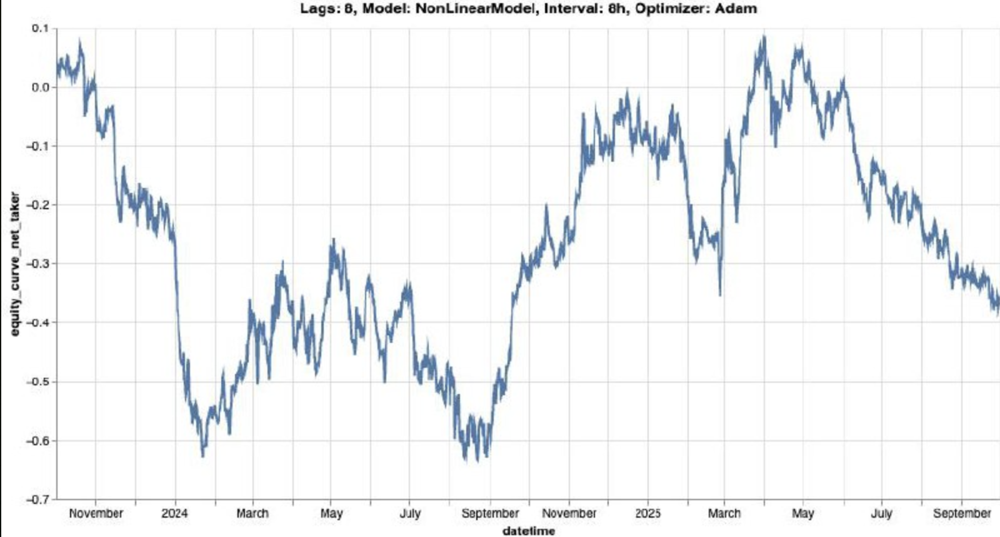  |                     |                        |                              |
| 14  | 8    | NonL  | 8           | NotAdam   | 0.458228         | -0.197070           |                  |                     |                           |                   |                      |                            |                     |                        |                              |
| 15  | 8    | NonL  | 12          | Adam      | 0.992712         | 0.557647            | 0.615613         | -0.257518           | 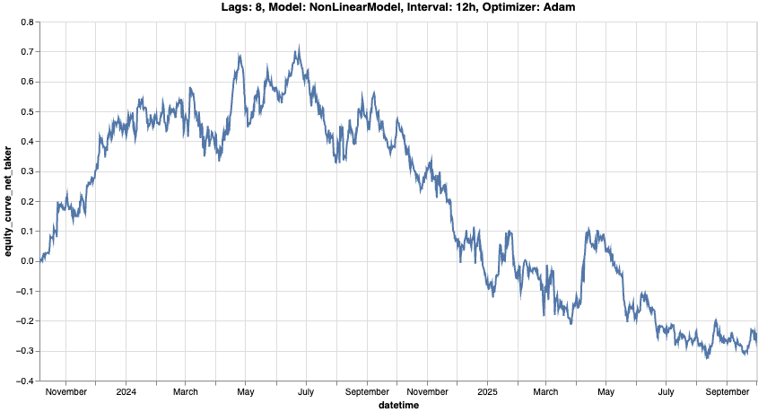  | 1.544768          | 0.668637             | 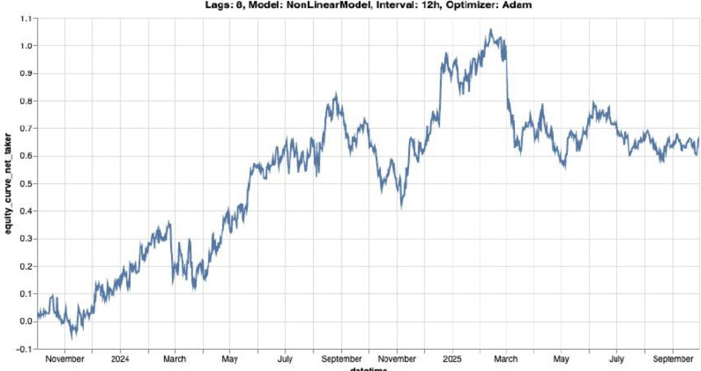  |                     |                        |                              |
| 16  | 8    | NonL  | 12          | NotAdam   | 1.061316         | 0.626251            | 0.508744         | -0.364387           |   | 1.339127          | 0.462996             | 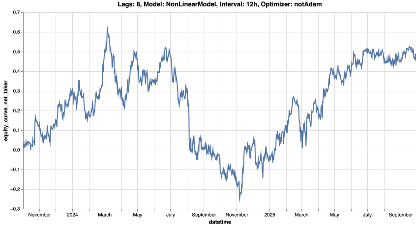  |                     |                        |                              |
| 17  | 12   | L     | 8           | Adam      | 0.371446         | -0.281452           |                  |                     |                           |                   |                      |                            | 0.672807            | -0.641390              | 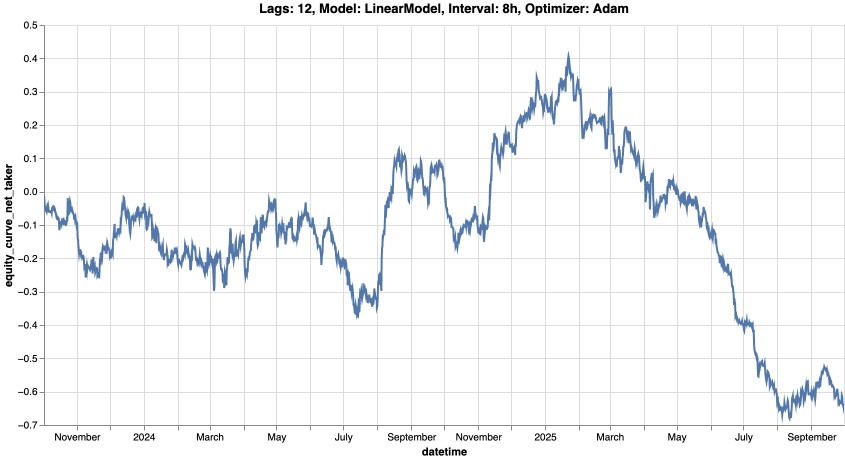    |
| 18  | 12   | L     | 8           | NotAdam   | 0.371446         | -0.281452           |                  |                     |                           |                   |                      |                            | 0.894795            | -0.419402              | 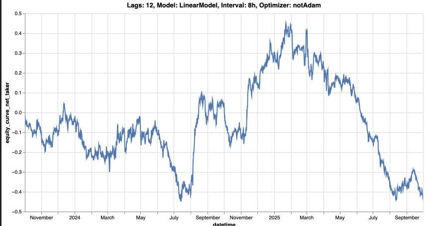    |
| 19  | 12   | L     | 12          | Adam      | 1.383116         | 0.950451            | 1.262150         | 0.391419            | 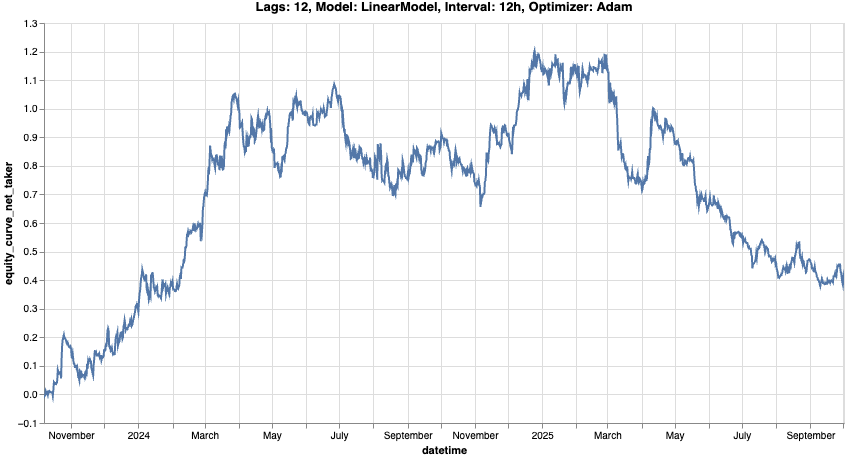  | 1.936348          | 1.060216             | 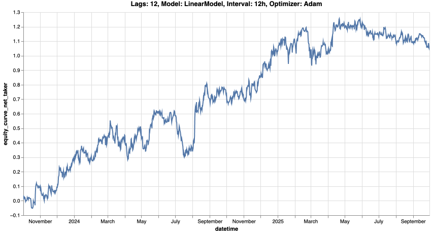  | 1.701184            | 0.825053               | 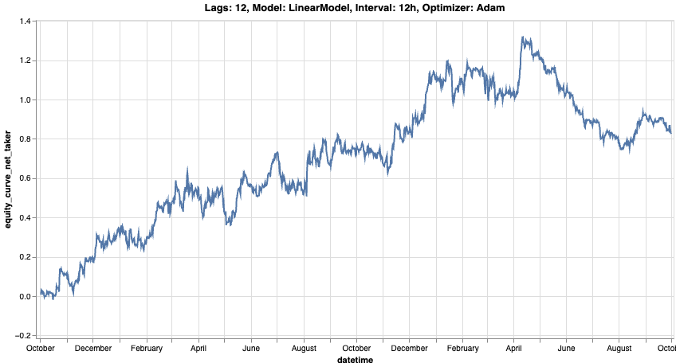    |
| 20  | 12   | L     | 12          | NotAdam   | 1.342437         | 0.909772            | 1.262150         | 0.391419            | 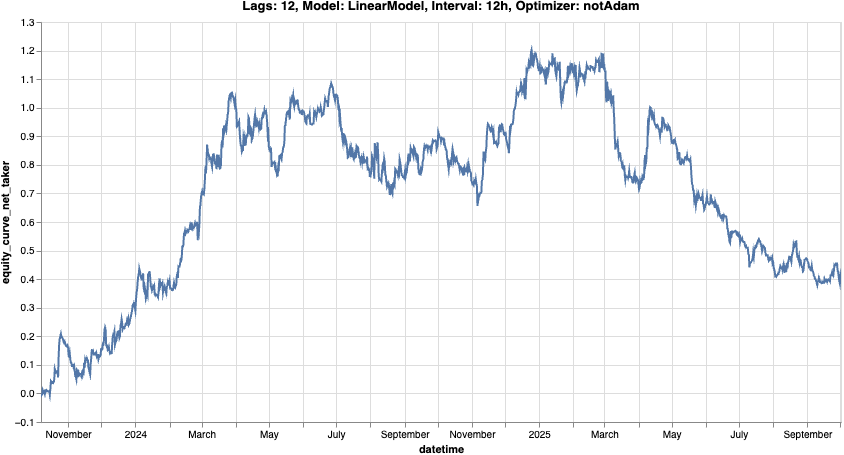  | 2.232592          | 1.356461             | 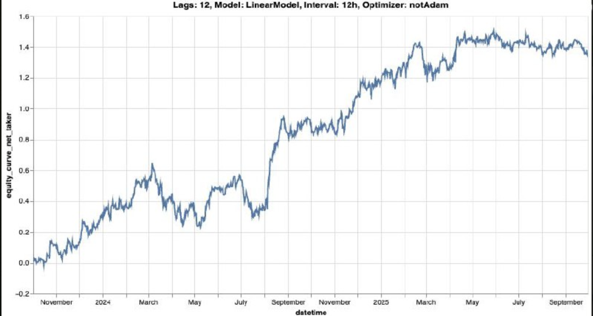  |                     |                        |                              |
| 21  | 12   | NonL  | 8           | Adam      | 0.448359         | -0.204539           |                  |                     |                           |                   |                      |                            |                     |                        |                              |
| 22  | 12   | NonL  | 8           | NotAdam   | 0.590187         | -0.062711           |                  |                     |                           |                   |                      |                            |                     |                        |                              |
| 23  | 12   | NonL  | 12          | Adam      | 0.666296         | 0.233631            |                  |                     |                           |                   |                      |                            |                     |                        |                              |
| 24  | 12   | NonL  | 12          | NotAdam   | 0.782313         | 0.349648            |                  |                     |                           |                   |                      |                            |                     |                        |                              |
| 25  | 16   | L     | 8           | Adam      | 1.316194         | 0.665696            | 2.436680         | 1.129084            |   | 1.175881          | 0.138316             | 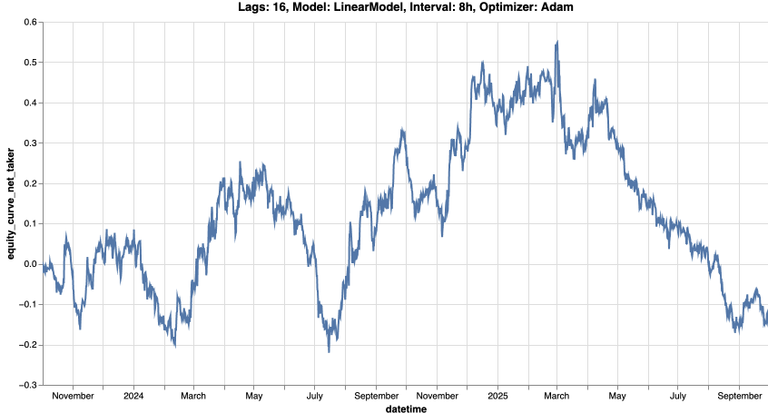  |                     |                        |                              |
| 26  | 16   | L     | 8           | NotAdam   | 1.316194         | 0.665696            | 2.473034         | 1.165437            | 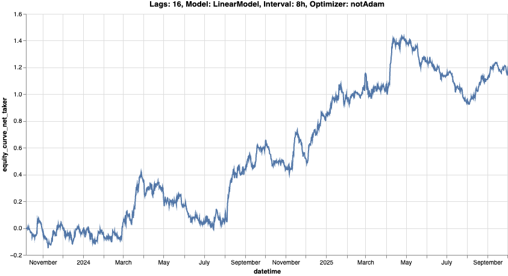 | 1.014824          | -0.299373            | 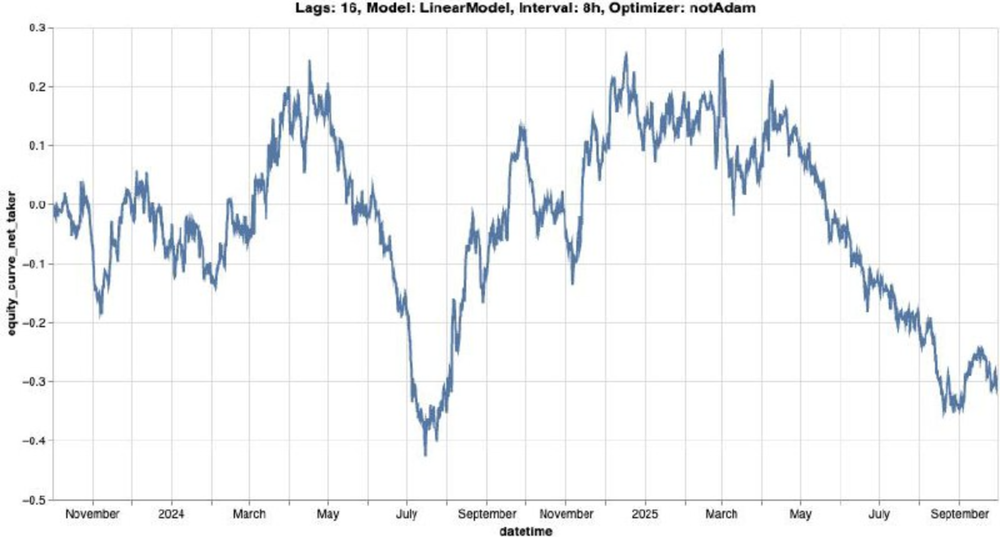  |                     |                        |                              |
| 27  | 16   | L     | 12          | Adam      | 0.922046         | 0.491781            | 1.061440         | 0.193110            | 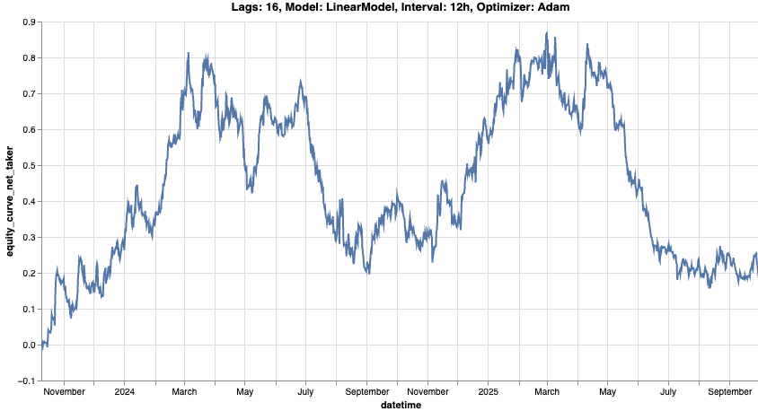 | 2.243165          | 1.367034             | 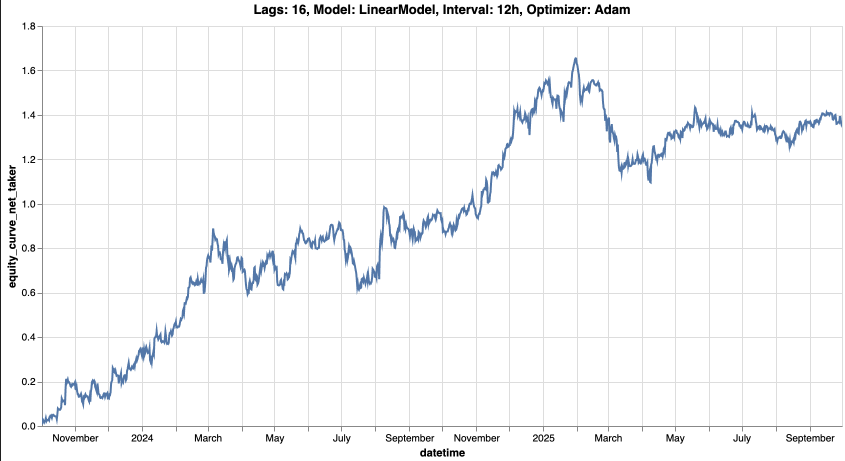  |                     |                        |                              |
| 28  | 16   | L     | 12          | NotAdam   | 0.922046         | 0.491781            | 1.140102         | 0.271772            | 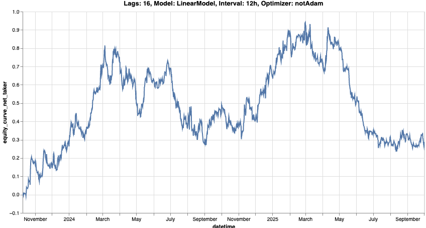 | 2.371790          | 1.495659             | 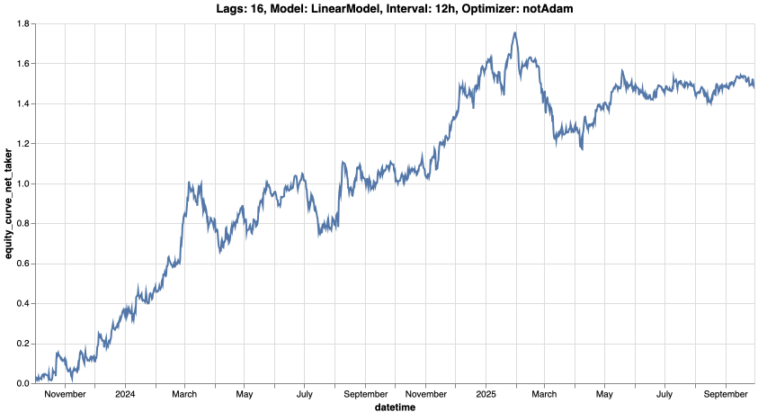  |                     |                        |                              |
| 29  | 16   | NonL  | 8           | Adam      | 0.542450         | -0.108047           |                  |                     |                           |                   |                      |                            |                     |                        |                              |
| 30  | 16   | NonL  | 8           | NotAdam   | 0.464727         | -0.185771           |                  |                     |                           |                   |                      |                            |                     |                        |                              |
| 31  | 16   | NonL  | 12          | Adam      | -0.291865        | -0.722129           |                  |                     |                           |                   |                      |                            |                     |                        |                              |
| 32  | 16   | NonL  | 12          | NotAdam   | -0.348447        | -0.778711           |                  |                     |                           |                   |                      |                            |                     |                        |                              |
| 33  | 24   | L     | 8           | Adam      | 0.985850         | 0.340153            |                  |                     |                           |                   |                      |                            |                     |                        |                              |
| 34  | 24   | L     | 8           | NotAdam   | 0.985850         | 0.340153            |                  |                     |                           |                   |                      |                            |                     |                        |                              |
| 35  | 24   | L     | 12          | Adam      | 0.575119         | 0.149655            |                  |                     |                           |                   |                      |                            |                     |                        |                              |
| 36  | 24   | L     | 12          | NotAdam   | 0.575119         | 0.149655            |                  |                     |                           |                   |                      |                            |                     |                        |                              |
| 37  | 24   | NonL  | 8           | Adam      | 0.369076         | -0.276621           |                  |                     |                           |                   |                      |                            |                     |                        |                              |
| 38  | 24   | NonL  | 8           | NotAdam   | -0.204223        | -0.849920           |                  |                     |                           |                   |                      |                            |                     |                        |                              |
| 39  | 24   | NonL  | 12          | Adam      | 0.935710         | 0.510247            |                  |                     |                           |                   |                      |                            |                     |                        |                              |
| 40  | 24   | NonL  | 12          | NotAdam   | 0.897664         | 0.472200            |                  |                     |                           |                   |                      |                            |                     |                        |                              |
